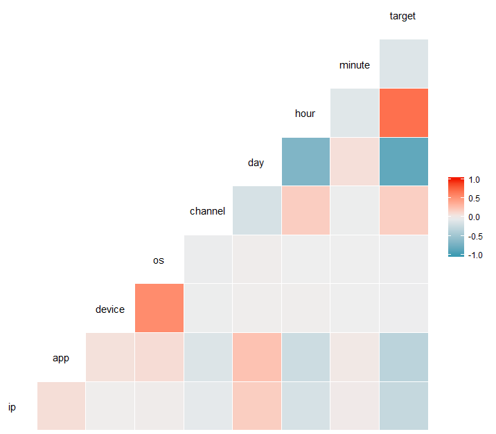
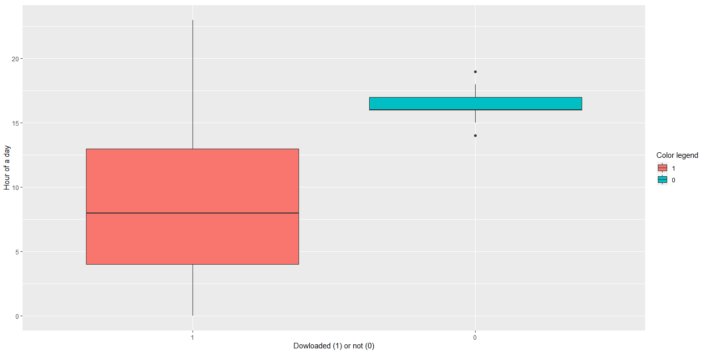
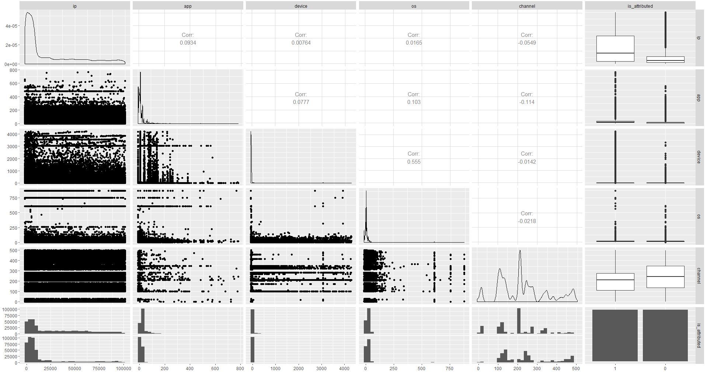
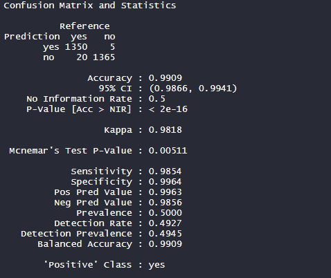
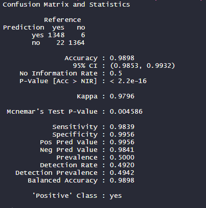
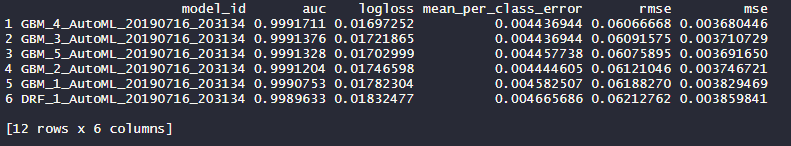

# Fraud Classification Project v1.0

Project proposed by the [Data Science Academy](https://www.datascienceacademy.com.br/), regarding fraud risk classification using R language.
This project is proposed due to the Formação Cientista de Dados course. You can see more at [Formação Cientista de Dados](https://www.datascienceacademy.com.br/bundles?bundle_id=formacao-cientista-de-dados).

### Summary

1. [About](#About)
2. [Personal framework for a systematic approach](#Personal-framework-for-a-systematic-approach)
3. [Plots of the analysis](#Plots-of-the-analysis)

## About

Fraud risk is everywhere, but for companies that advertise online, click fraud can happen at an overwhelming volume, resulting in misleading click data and wasted money. Ad channels can drive up costs by simply clicking on the ad at a large scale. With over 1 billion smart mobile devices in active use every month, China is the largest
mobile market in the world and therefore suffers from huge volumes of fraudulent traffic.

TalkingData, China’s largest independent big data service platform, covers over 70% of active mobile devices nationwide. They handle 3 billion clicks per day, of which 90% are potentially fraudulent. Their current approach to prevent click fraud for app developers is to measure the journey of a user’s click across their portfolio, and flag IP addresses who produce lots of clicks, but never end up installing apps. With this information, they've built an IP blacklist and device blacklist.

I am challenged to build an algorithm that predicts whether a user will download an app after clicking a mobile app ad. To support the modeling, the TalkingData have provided a generous [dataset](https://www.kaggle.com/c/talkingdata-adtracking-fraud-detection/data) covering approximately 200 million clicks over 4 days!

## Personal framework for a systematic approach

### FUNDAMENTALS

1. Problem statement and comprehension of the context
    - What am I trying to solve?
    - Who will benefit of/is asking for this solution?
    - What would be the ideal scenario for them?
    - How could I use the available data to help them achieve this scenario?
    - Why solve this problem? (purpose)

2. Looking for data:
    - Identify entities (and its attributes) of the problem
    - Collect data that represents entities
    - Which hypotheses could I suppose?
    - Explore the data (superficially) to understand it
    - Could I use an algorithm to address the issue or solve it? Which one?

### DATA WRANGLING

3. Data preparation and Exploration (Feature Engineering orientated to the 4th and 5th phase)
    - Is my dataset tidy?
    - Is my dataset clean?
    - Which correlations exists between all variables and to the target?
    - There is any NA in my dataset? If so, how should I treat them? Which effects would it have?
    - Should I narrowing in on observations of interest? Which effects would it have?
    - Should I reduce my variables? Which effects would it have?
    - Should I create new variables that are functions of existing ones? Which effects would it have?
    - Should I binning variables? Which effects would it have?
    - should I convert variables (categorical = numerical / vv)? Which effects would it have?
    - Should I dummy coding categorical variables? Which effects would it have?
    - Should I standardize numerical variables? Which effects would it have?
    - Can I test my hypotheses?

4. Building and validating models (orientated to the 5th phase)
    - Train and test a ML model
    - Which performance metrics should I rely on?
    - Iteration

### DEPLOYING

5. Deploy
    - Data StoryTelling
    - How can I deploy the model to production?
    - Which strategies should I consider?
    - [An overview of what should be considered](https://christophergs.github.io/machine%20learning/2019/03/17/how-to-deploy-machine-learning-models/)

## Plots of the analysis

### 1. ggcorr plot - a correlation matrix with ggplot2

### 2. geom_boxplot - a box and whiskers plot

### 3. ggpairs - a ggplot2 generalized pairs plot

### 4. Confusion Matrix and statistics on Random Forest predictions

### 5. Confusion Matrix and statistics on Boosted Tree predictions

### 6. Printing of the top models generated by the auto ML tool of h2o

